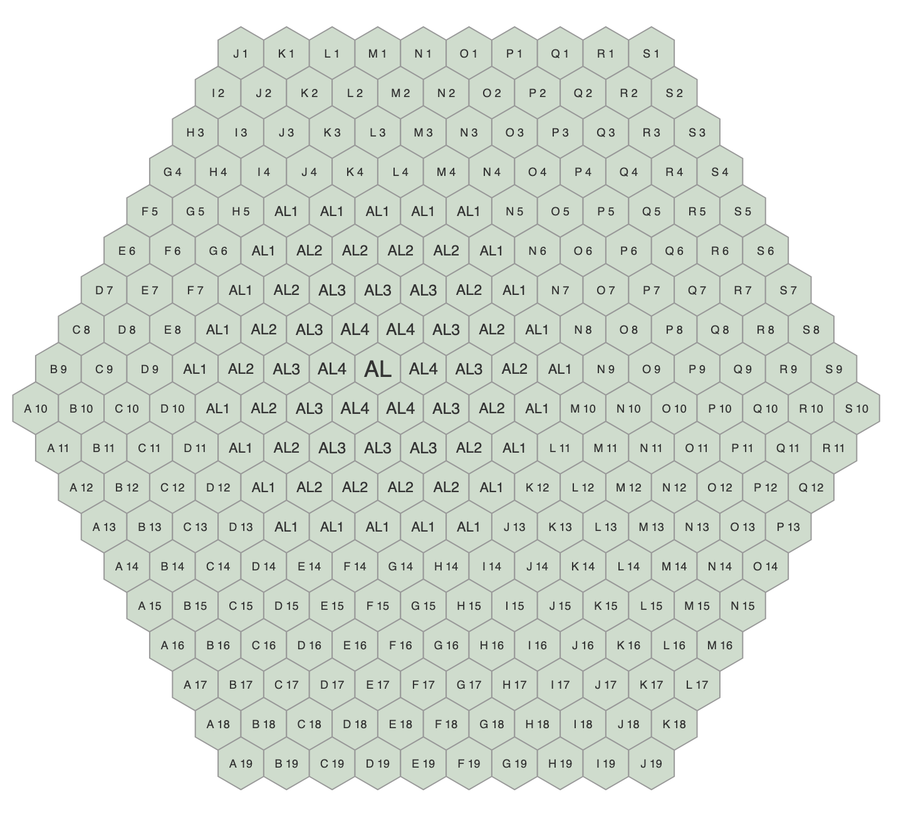
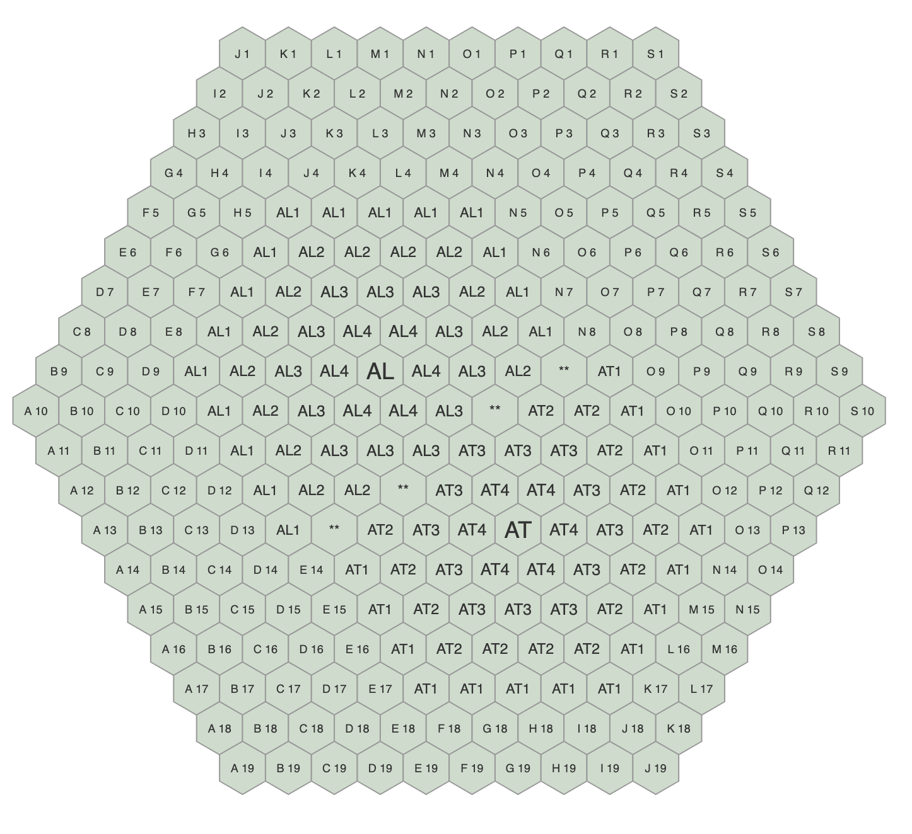
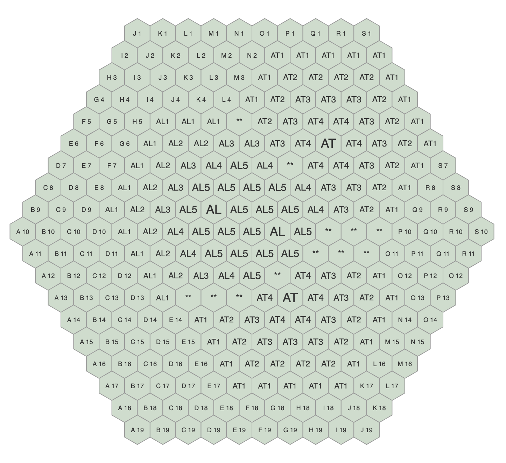

# Rules for FUZZY BORDERS    version 1.0

(1) The game is played on a hexagonal board (10 cells to an edge), with
hexagonal cells ("hexes") on it, as shown below. Each cell borders 6 others.
Coordinates are indicated with numbers for the rows (starting with **1** for
the top and continuing to **19** at the bottom), and letters for the NW-SE
diagonals. The southwest edge is diagonal **A** and the northeast edge is
diagonal **S**. The center cell is **J10**.

(2) Each turn each player claims a cell on the board, by naming its coordinates.
The consequences of claiming a cell is that the player owns that cell for the
duration of the game, and also exercises influence over the cells that
surround it. This influence decreases to a distance of 4 cells away from the
claimed cell. Claimed cells are worth 10. Suppose there's only one player, Ada,
and she claims cell I9, then the board looks as follows:

(Ada has 130 points)

(3) If two or more players have influence over the same cell, then the cell is
considered to be under the influence of the player with the highest total
applying to it. If two or more players tie for the largest influence over a
cell, then that cell is considered uninfluenced. Suppose besides Ada (AL) we have
Alan (AT) as a player in this first turn, and he claims cell J10, then the board
would look like this:

(Both players have 114 points)

(4) Influence created in subsequent turns is added to influence the player
already has on the board. If the total of a player's net influence in a cell
reaches 5 or more, that player "owns" it. A cell gained this way is worth 5
points, but it does not exert influence over its surroundings. When more than 
two players have influence in a cell, we only compare the difference between
the highest total influence and second highest.

Suppose that in the second turn Ada claims cell K10 while Alan
claims cell O6, then the board would look like this:

(Ada has 183 points, Alan has 189)

(5) You cannot claim a cell under another player's influence, but you **can**
claim uninfluenced cells, or cells under your own influence.

(6) When two (or more) players try to claim the same space:
a) on the first turn, the GM will choose a different symmetric position to
 play the pieces. 
b) in a two-player game, the GM will request new moves from both players (or
announce a turn with no new placements.)
c) otherwise, the participating players bounce and don't get a placement that
turn.

(7) Any amount of players is okay (at least 2 of course). The more players
there are, the more it makes sense to negotiate with others.

(8) The size of the board and the size of the sphere of influence around a
claimed cell can be changed at wish (but not during a game of course). With
more players, it would make sense to use a bigger playing surface, but the
trade-offs here haven't been explored.

(9) The game ends when there are no uninfluenced (empty) cells left on the
board. The player with the largest amount of points (the sum total of all
points indicated in the cells he owns or influences) wins.

These rules are based on rules I received from Harold Reynolds in 1999.
Reynolds ran "The Maple Leaf Rag", a subzine to "The Bluesmobile". I played
as a sub in one game run under "Reynolds Variant" rules. The rules above
attempt to clarify some edge cases not covered in the original rules. 
